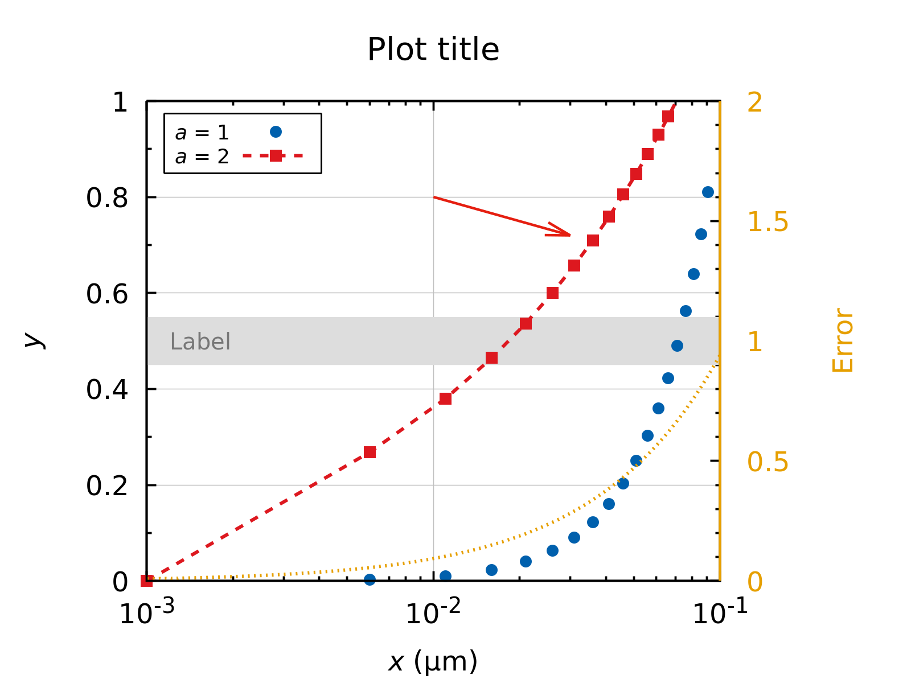

# gnuplot template

A simple template for plotting in [gnuplot](http://www.gnuplot.info/).

## Usage

Download the template (`template.plt`), modify for your needs, comment out the features you don't need (e.g., arrows, labels, etc.), and produce a print-ready plot using

```bash
gnuplot template.plt
```

The plot will be saved to a PNG file.

## Plot example

<p align="center">

</p>
