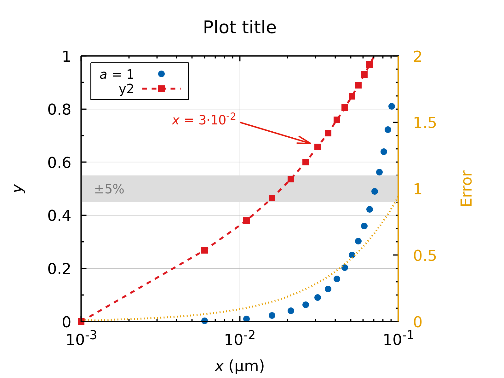

# gnuplot template

A simple template for 2D plotting in [gnuplot](http://www.gnuplot.info/).

## Usage

Download the template (`template.plt`), modify for your needs, comment out the features you don't need (e.g., arrows, labels, second y-axis, etc.), and produce a nice looking publish-ready 2D plot of your data using

```bash
gnuplot template.plt
```

The plot will be saved to a PNG file.

## Plot example

Includes all features from the template (e.g., different line/marker types, colors, customisable legend, log-scale, extra labels, arrows, second y-axis, special characters, etc.):

<p align="center">

</p>
